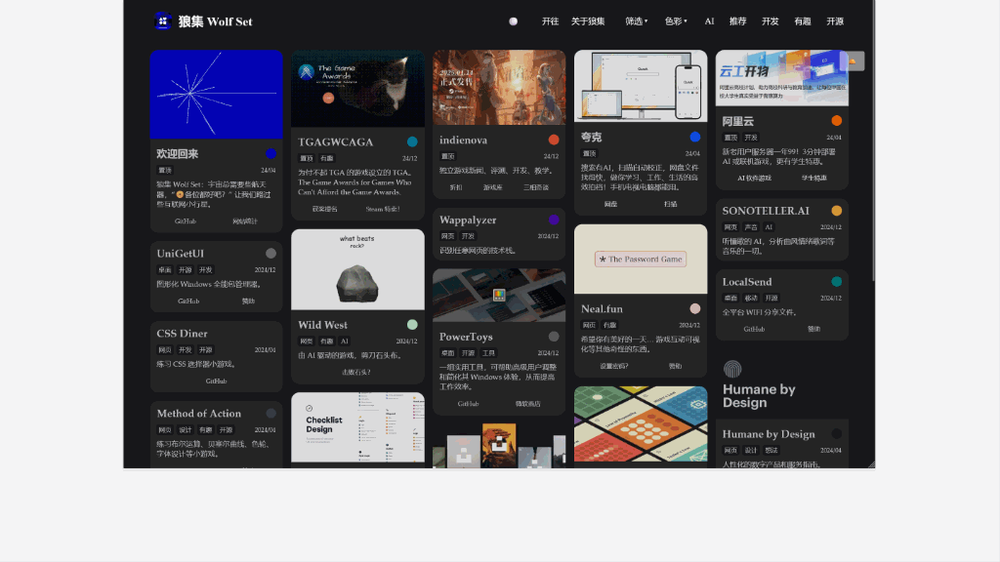

## 一、简介

Bluf 是一款**慵懒**的瀑布流网址导航 Hugo 主题，源于 Wolf Set（[狼集](https://ws.0000cd.com/)） 导航的实践。

与传统“规整”的网址导航相比，**自适应瀑布流**的 bluf 要随性得多，长短随意，插图随心。还有标签或颜色**筛选**、**深色**模式、网站统计、访客问候等贴心功能，更支持**多链接、多图画廊**等模式。

一切只需 YAML 轻松配置。



## 二、安装

### 2.1 快速上手

本教程基于“无需修改代码”的难度，几乎无需付费，只需三步在 [狼集](https://ws.0000cd.com/) 内容的基础上有一个属于自己的网址导航。

#### 步骤 0：准备

1. 确保你已注册 Github 与 Cloudflare 账号，我们将用此存储与发布网页。
2. （可选但推荐）准备一个你自己的域名，有助于提高国内的访问速度。

<details>

<summary>继续浏览安装步骤…</summary>

---

#### 步骤 1：复制仓库到你的 Github

1. 点击 [本页面](https://github.com/0000cd/wolf-set) 右上角的 fork 按钮，复制项目到你的 Github 仓库。
2. 记住你复制时的仓库名。（稍后会用到）

#### 步骤 2：修改网站的基础配置

1. 在你刚 fork 的仓库首页，点开 `hugo.toml` 文件（根目录）。
2. 根据文件中的注释，编辑文件，修改以下内容：
     - 网址、网站名称、首页标题、SEO 信息、授权信息、网站统计等。
     - 注意：如你还不确定网址，可先跳过，稍后记得修改。
     - 注意：toml 格式，不要丢失两侧的英文引号`"`。

```toml
# hugo.toml 文件部分示例：
baseURL = "https://ws.0000cd.com/" #你的网址
languageCode = "zh-CN"
title = "狼牌网址导航 - 狼集 Wolf Set" #网站名称
theme = "bluf"
#……
```

#### 步骤 3：使用 Cloudflare Pages 发布网页

1. 打开 [Cloudflare Pages](https://pages.cloudflare.com/)，点击创建 - Pages - 连接到 Git - Github，选择你刚记住仓库名的项目。
2. 点击开始设置，修改以下内容：
    - 项目名称（注意：若没有你自己的域名，这将是你默认域名的一部分）
    - 预设框架，选择 `Hugo` （无需修改其他默认设置）。
3. 点击保存并部署，通常会在一分钟内会完成，**但首次部署你还需再等 2~3 分钟**，才能点开预览链接在网上看到你的网页，请坐和放宽。
4. 修改并绑定域名：
    - 如果你有自己的域名，请在项目内找到自定义域，按提示绑定域名。
    - 如果你没有自己的域名，请记住 Cloudflare 提供的默认域名（如 xxx.pages.dev）。
    - 确认之前 `hugo.toml` 的网址已完成修改。

---

#### 常见问题

- 访问异常：如你无法访问 Cloudflare 默认提供的域名，或访问速度过慢，请绑定你自己的域名。
- 部署失败：
  - 如你部署失败，看一下部署日志，并检查你选对了仓库，以及 `hugo.toml` 内的格式。
  - 如你用的不是 Cloudflare，而是 Vercel 或 Netlify 等平台部署失败，你可能需要在选择预设框架时，配置环境变量 hugo 版本为较新版本，如 `HUGO_VERSION = 0.117.0`。

### 2.2 Hugo 开始

如果你对 Hugo 有一定了解，可直接用我们自写的 Bluf 主题来构建你的网站。只需先复制 themes/bluf 到你的项目，并在 hugo 中设置 `theme = "bluf"`。

Bluf 主题代码已经过多次测试，可稳定上线使用，但部分代码仍在清理中，因此暂不提供详细教程。如有任何问题或建议，欢迎通过 Issues 提交反馈！我们期待你的参与。

</details>

## 三、使用

如果你是按上面的教程 Cloudflare 部署的，您只需编辑对应的文件，在保存后 Cloudflare 会自动部署更改，片刻后更新到网页上。只需留意 TOML 或 YAML 格式，就能规避常见错误。

但即使你熟悉 Hugo，也推荐浏览一下使用说明。因为与大多数 Hugo 内容在 content 不同，Bluf 更接近单页主题，其主要在 data 目录下。

### 3.1 导航卡片

#### 增删首页的导航卡片

请编辑 `data/cards.yaml`。该文件是 YAML 格式易于使用，如下：

```yaml
- title: Humane by Design # 卡片标题
  hex: "#14151d" # （可选）卡片颜色，会自动颜色分类。注意引号
  tags: # 卡片标签，会标签分类
  - 网页
  - 设计
  - 想法
  date: "2024/04" # （可选）卡片时间
  description: 人性化的数字产品和服务指南。 # 卡片描述
  links: https://humanebydesign.com/ #卡片链接

```

提示：在 Markdown 文章中…
- 插入 `` 短码，可让该页面随机跳转所有导航网址。
- 插入 `` 或 ` ` 短码，可统计所有或指定标签的导航卡片总数。如：`本站共  个有趣网址导航，和  个开源项目！`

<details>

<summary>继续浏览使用，如：导航卡片、导航栏、筛选、问候语、授权、个性化、SEO…</summary>

#### 导航卡片配置多条链接

如果上文的 `links`，需要多条链接，你还可以这样写：

```yaml
- title: Neal.fun
  hex: "#ffc7c7"
  tags:
  - 网页
  - 有趣
  date: "2024/12"
  description: 希望你有美好的一天… 游戏互动可视化等其他奇怪的东西。
  links:
  - name: 官网 #注意，第一条链接不会展示，而是作为卡片整体的链接
    url: https://neal.fun/
  - name: 设置密码？
    url: https://neal.fun/password-game/
  - name: 赞助
    url: https://buymeacoffee.com/neal
```

#### 导航卡片头图、画廊模式

无需额外配置，只需将与卡片 `title` 名称一致的图片，放入 `assets/img` 文件夹下即可，如 `assets/img/Neal.fun.webp`。支持 jpg、png、gif、webp 格式，建议图片宽度大于 300px，但过大会影响加载速度。提示：可以获取网站的 `Open Graph` 用于插图。

请编辑 `hugo.toml`，先 `gallery = true` 开启画廊模式。之后在 `assets/gallery` 创建与卡片 `title` 名称一致的的文件夹（注意特殊符号），并放入多张图片（按文件名排序），再点击卡片头图就能进入画廊模式，浏览多张图片。适合像相册一样分享图片合集使用，如：

```markdown
- assets
  - gallery
    - Humane by Design
      - a.jpg
      - 2.webp
      - Cat.gif
```
---

### 3.2 标签筛选与导航栏

#### 配置导航卡片标签

请编辑 `data/tag_classes.yaml`，将管理用于筛选的标签的映射关系：

```yaml
桌面："desktop"
移动："mobile"
网页："web"
```

如你配置 `桌面："desktop"`，在 `cards.yaml` 的 `tags` 只需输入“桌面”，就能按“desktop”筛选导航卡片。

特别的，由于颜色筛选是算法自动完成的，不建议修改颜色筛选的值。

#### 配置导航栏外链、筛选、标签

请编辑 `data/navbar.yaml`，分别在 `external_links`、`categories`、`hot_tags` 下配置外链、筛选、标签。

---

### 3.3 更多特色功能

#### 网站问候、庆祝撒花

请编辑 `hugo.toml`，会在访问首页时随机展示问候，为空不启用；也可为移动端单独配置问候，用于引导：

```toml
[params]

  greetings = [
    #……
    "Ctrl+D 收藏本站 ⭐",
    "点击【标签】，筛选内容 🔖",
    "点击 ●，切换深浅配色 🐼",
] #访客随机问候，为空不启用
  mobileGreetings = [
    "推荐电脑访问，体验更佳 💻",
] #移动端访客随机问候，为空使用 greetings
```

输入喜欢的 emoji，会在用户清除筛选时庆祝撒花，感谢用户的访问，为空不启用：

```toml
confettiEmojis = [ '🥟', '🍜', '🍊', '🧧', '🧨', '🏮', '🎉', '🐺' ] # 清除筛选时撒花，为空不启用
```

#### 配置 CC 授权信息

请编辑 `hugo.toml` 的 `license`，会写入网站的 Meta 信息（游客不会直接看到）。

可进一步在 `layouts/partials/cc.html` 配置页脚的授权信息（只在文章页脚，不会显示在首页），如不需要可删除。

访问 [CC 授权](https://chooser-beta.creativecommons.org/) 选择授权协议，并生成页脚授权的代码。

#### 网站个性化、图标、配色

请在 `static` 下覆盖 `logo`、`favcion` 等文件修改图片，修改图标。推荐使用 [favicon.io](https://favicon.io/)。

请编辑 `hugo.toml`，修改强调色，点击导航栏的 ⚫ 切换深浅配色：

```toml
[params]

  lightColor = "#0000cd" # 浅色强调色，推荐较深
  darkColor = "#fafafa" # 深色强调色，推荐较浅
```

#### 优化 SEO、网站统计

请编辑 `hugo.toml` 优化 SEO，支持隐私友好的开源 [Umami](https://umami.is/) 统计。

如你使用 Cloudflare 部署，可在该项目下的指标，开启 Web Analytics 进行统计。

可在 `content/achrive` 下放置历史数据，辅助优化搜索的 SEO。

如需 Search Console 等平台验证网站所有权，请将验证文件放在 `static` 下。

</details>

---

## Bluf theme

[](https://sonarcloud.io/summary/new_code?id=0000cd_wolf-set)

Bluf 是一款简明扼要的**瀑布流**卡片式 Hugo 主题，非常适合脑暴、作品集、链接导航、等需要**简单分享**的场景。部分代码由 GPT-4o 与 Claude-3.5  AI 协助。

### 灵感

Blue + Wolf = Bluf

> BLUF (bottom line up front) is the practice of beginning a message with its key information (the "bottom line"). This provides the reader with the most important information first.
> BLUF（先行底行）是一种沟通方式，即在信息的开始部分先给出关键信息（即“底行”）。这样做可以让读者首先了解到最重要的信息。

## License

本项目基于 **[Hugo](https://gohugo.io/)** 框架，并采用自建的 **Bluf** 主题：

- `content` 与 `data` 目录下的内容遵循 **[CC BY-NC 4.0](https://creativecommons.org/licenses/by-nc-sa/4.0/deed.zh-hans)** 许可协议共享。
- **Bluf** 主题因集成 **[Isotope](https://isotope.metafizzy.co/license)**，遵守 **GPLv3** 许可协议。
- 画廊模式：[baguetteBox.js](https://github.com/feimosi/baguetteBox.js)，MIT 协议。
- 庆祝撒花：[js-confetti](https://github.com/loonywizard/js-confetti)，MIT 协议。